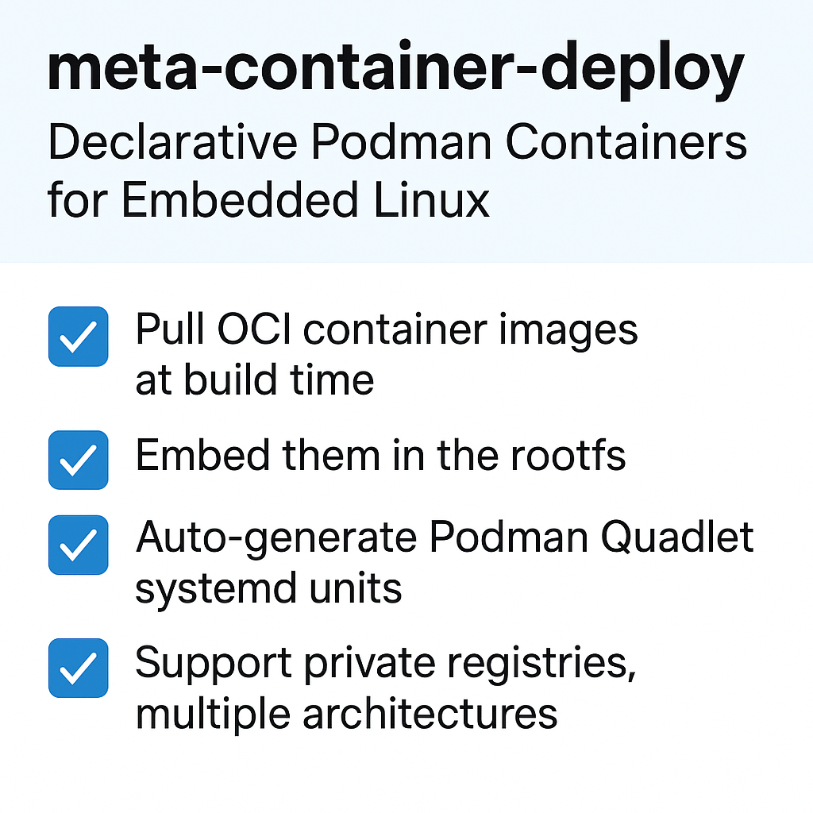

# meta-container-deploy

<p align="center">
  
</p>

Yocto/OpenEmbedded layer for declarative Podman container support with build-time image pulling and systemd Quadlet integration.

> **⚠️ Disclaimer**
>
> This layer is provided **as-is** and is under active development. Expect frequent changes, breaking updates, and evolving APIs. While the code is functional and tested, it is not yet intended for production use. Use at your own risk.

## Overview

meta-container-deploy provides BitBake classes and recipes to:

1. **Pull container images at build time** using skopeo-native and include them in the rootfs
2. **Generate Podman Quadlet files** (.container units) for declarative systemd service management
3. **Define containers declaratively** via YAML/JSON manifests or BitBake variables

This enables reproducible, air-gapped container deployments for embedded Linux systems.

## Features

- **Build-time container image pulling** - Images are pulled during bitbake using skopeo-native
- **OCI format storage** - Images stored in standard OCI layout for portability
- **Podman Quadlet integration** - Modern declarative systemd container management
- **Pod support** - Group containers into pods for shared network namespace and atomic lifecycle
- **Architecture mapping** - Automatic TARGET_ARCH to OCI architecture conversion
- **Private registry support** - Authentication via Docker config.json, custom TLS certificates
- **Dependency management** - Container service ordering via systemd dependencies
- **Security options** - Capabilities, security labels, read-only rootfs support
- **Image verification** - Post-pull OCI structure validation (default) and optional pre-pull registry checks
- **Rootfs auto-expansion** - Automatically expand root filesystem to full storage capacity on first boot (ideal for SD card deployments)

## Technology Overview

### Podman

[Podman](https://podman.io/) is a daemonless, open-source container engine for developing, managing, and running OCI containers on Linux systems. Unlike Docker, Podman doesn't require a background daemon process, making it ideal for embedded systems where resource efficiency is critical.

Key advantages for embedded Linux:
- **Daemonless architecture** - No background service consuming resources
- **Rootless containers** - Run containers without root privileges for enhanced security
- **Systemd integration** - Native support for running containers as systemd services
- **Docker-compatible** - Uses the same container images and CLI syntax as Docker

### Podman Quadlet

[Quadlet](https://docs.podman.io/en/latest/markdown/podman-systemd.unit.5.html) is Podman's native systemd integration, introduced in Podman 4.4 (February 2023). It allows you to define containers declaratively using `.container` files that systemd's generator converts into proper service units.

How Quadlet works:
1. Place `.container` files in `/etc/containers/systemd/` (or `~/.config/containers/systemd/` for user containers)
2. On boot (or `systemctl daemon-reload`), Quadlet's generator parses these files
3. Systemd creates transient service units from the container definitions
4. Containers are managed like any other systemd service

Example `.container` file generated by this layer:
```ini
[Unit]
Description=nginx-server container service
After=network-online.target
Wants=network-online.target

[Container]
Image=docker.io/library/nginx:alpine
PublishPort=8080:80

[Service]
Restart=always
TimeoutStartSec=900

[Install]
WantedBy=multi-user.target
```

Benefits over traditional approaches:
- **Declarative** - Define what you want, not how to run it
- **Integrated** - Uses standard systemd dependency management
- **Reliable** - Proper service lifecycle, restart policies, and logging
- **Simple** - No custom scripts or wrapper services needed

### Skopeo

[Skopeo](https://github.com/containers/skopeo) is a command-line utility for working with container images and registries. This layer uses `skopeo-native` (the host-side build tool) to pull container images during the BitBake build process.

Skopeo capabilities used by this layer:
- **Copy images between registries and local storage** - Pull from Docker Hub, Quay.io, or private registries
- **Support multiple image formats** - Convert between Docker v2, OCI, and other formats
- **Architecture selection** - Pull images for specific CPU architectures (arm64, amd64, etc.)
- **Authentication** - Support for private registry credentials via Docker config.json

Build-time vs. runtime usage:
- **Build time**: `skopeo-native` pulls images and stores them in OCI format in the rootfs
- **Runtime**: `skopeo` (or `podman load`) imports preloaded images into Podman's storage

### OCI Format

The [Open Container Initiative (OCI)](https://opencontainers.org/) defines industry standards for container formats and runtimes. This layer stores pulled images in OCI Image Layout format, which provides:

- **Portability** - Standard format readable by any OCI-compliant tool
- **Content-addressable storage** - Images identified by cryptographic digests
- **Multi-architecture support** - Single image can contain manifests for multiple platforms
- **Reproducibility** - Deterministic image identification via digest pinning

OCI image layout structure:
```
/var/lib/containers/preloaded/
└── nginx-server/
    ├── blobs/
    │   └── sha256/
    │       ├── <config-digest>
    │       ├── <layer-digests>...
    │       └── <manifest-digest>
    ├── index.json
    └── oci-layout
```

### Architecture Mapping

Yocto's `TARGET_ARCH` values differ from OCI platform architectures. This layer automatically maps between them:

| Yocto TARGET_ARCH | OCI Architecture |
|-------------------|------------------|
| `aarch64`         | `arm64`          |
| `arm`             | `arm`            |
| `x86_64`          | `amd64`          |
| `i686`, `i586`    | `386`            |
| `riscv64`         | `riscv64`        |
| `powerpc64le`     | `ppc64le`        |

You can override automatic detection using `CONTAINER_ARCH` variable if needed.

### Systemd Integration

This layer requires systemd as the init manager because:

1. **Quadlet depends on systemd** - The generator mechanism is a systemd feature
2. **Service dependencies** - Container ordering uses systemd's `After=`/`Requires=` directives
3. **Lifecycle management** - Restart policies map to systemd's `Restart=` options
4. **Logging** - Container output goes to the journal via `journalctl`

The boot sequence:
1. `container-import.service` runs early (before container services)
2. Import scripts load OCI images into Podman storage
3. Quadlet generator creates service units from `.container` and `.pod` files
4. Pod and container services start in dependency order

### Podman Pods

[Pods](https://docs.podman.io/en/latest/markdown/podman-pod.1.html) are groups of containers that share resources. This layer supports Quadlet `.pod` files for declarative pod management.

**When to use pods:**
- Multiple containers form a single application (e.g., web app + cache + sidecar)
- Containers need to communicate via `localhost`
- You want atomic upgrades of the entire application
- Port management should be centralized at pod level

**When to use individual containers:**
- Components have independent release cycles
- You need to upgrade components separately
- Containers are loosely coupled services

Example `.pod` file generated by this layer:
```ini
[Unit]
Description=myapp pod
After=network-online.target container-import.service
Wants=network-online.target

[Pod]
PodName=myapp
PublishPort=8080:8080
PublishPort=8081:8081
Network=bridge

[Install]
WantedBy=multi-user.target
```

Pod members reference their pod in `.container` files:
```ini
[Container]
Image=myregistry/backend:v1
Pod=myapp.pod
```

## Requirements

- Yocto Project: Scarthgap (5.0) or Styhead (5.1)
- meta-virtualization layer (for podman, skopeo recipes)
- systemd as init manager
- Podman 4.4+ (for Quadlet support)

**Note:** Kirkstone (4.0) is not supported because meta-virtualization provides Podman 4.0.x for Kirkstone, which predates Quadlet support (introduced in Podman 4.4, February 2023).

## Installation

Add the layer to your `bblayers.conf`:

```bitbake
BBLAYERS += "/path/to/meta-container-deploy"
```

Ensure meta-virtualization is also included.

## Quick Start

This layer provides **4 methods** to include containers in your Yocto image:

| Method | Best For | Configuration Location |
|--------|----------|----------------------|
| 1. Direct Recipe | Static, versioned container recipes | `.bb` recipe files |
| 2. local.conf Variables | Dynamic provisioning, CI/CD pipelines | `local.conf` |
| 3. Manifest-Based | Standalone projects, config versioning | `containers.yaml` |
| 4. Packagegroup | Grouping multiple container recipes | Packagegroup recipe |

### Prerequisites

Add to your `local.conf` to enable systemd (required for Quadlet):

```bitbake
DISTRO_FEATURES:append = " systemd usrmerge virtualization"
DISTRO_FEATURES_BACKFILL_CONSIDERED:append = " sysvinit"
VIRTUAL-RUNTIME_init_manager = "systemd"
VIRTUAL-RUNTIME_initscripts = "systemd-compat-units"

# Required for container networking (iptables/netfilter modules)
IMAGE_INSTALL:append = " kernel-modules"
```

---

### Method 1: Direct Recipe Approach (Traditional)

Create individual `.bb` recipe files that inherit the container classes.

**Create a recipe:**

```bitbake
# recipes-containers/webserver/nginx-server.bb
SUMMARY = "Nginx web server container"
LICENSE = "MIT"
LIC_FILES_CHKSUM = "file://${COMMON_LICENSE_DIR}/MIT;md5=0835ade698e0bcf8506ecda2f7b4f302"

inherit container-image container-quadlet

CONTAINER_IMAGE = "docker.io/library/nginx:alpine"
CONTAINER_NAME = "nginx-server"
CONTAINER_PORTS = "8080:80"
CONTAINER_RESTART = "always"
```

**Add to your image:**

```bitbake
IMAGE_INSTALL:append = " nginx-server packagegroup-container-support"
```

**Build and run:**

```bash
bitbake core-image-minimal
# Boot the image, then:
systemctl status nginx-server
curl localhost:8080
```

#### Using Pods with Direct Recipes

Create a pod recipe and container recipes that reference it:

```bitbake
# recipes-containers/myapp/myapp-pod.bb
inherit container-pod

POD_NAME = "myapp"
POD_PORTS = "8080:8080 6379:6379"
POD_NETWORK = "bridge"
```

```bitbake
# recipes-containers/myapp/myapp-web.bb
inherit container-image container-quadlet

CONTAINER_IMAGE = "docker.io/library/nginx:alpine"
CONTAINER_NAME = "myapp-web"
CONTAINER_POD = "myapp"  # Joins the pod - no ports needed here
CONTAINER_RESTART = "always"
RDEPENDS:${PN} += "myapp-pod"
```

---

### Method 2: local.conf Variable-Based

Configure containers entirely in `local.conf` without creating recipe files. Ideal for CI/CD pipelines and dynamic provisioning systems that generate `local.conf` at build time.

**Add to `local.conf`:**

```bitbake
# List of containers to deploy
CONTAINERS = "mqtt-broker nginx-proxy"

# MQTT broker configuration
CONTAINER_mqtt_broker_IMAGE = "docker.io/eclipse-mosquitto:2.0"
CONTAINER_mqtt_broker_PORTS = "1883:1883 9001:9001"
CONTAINER_mqtt_broker_VOLUMES = "/data/mosquitto:/mosquitto/data:rw"
CONTAINER_mqtt_broker_RESTART = "always"

# Nginx proxy configuration
CONTAINER_nginx_proxy_IMAGE = "docker.io/library/nginx:alpine"
CONTAINER_nginx_proxy_PORTS = "80:80 443:443"
CONTAINER_nginx_proxy_DEPENDS_ON = "mqtt-broker"

# Add to image
IMAGE_INSTALL:append = " packagegroup-containers-localconf"
```

**Note:** Container names with `-` or `.` are converted to `_` in variable names (e.g., `mqtt-broker` becomes `CONTAINER_mqtt_broker_*`).

**Build and run:**

```bash
bitbake core-image-minimal
# Boot the image, then:
systemctl status mqtt-broker
systemctl status nginx-proxy
```

#### Using Pods with local.conf

```bitbake
# Define pods
PODS = "myapp"
POD_myapp_PORTS = "8080:8080 6379:6379"
POD_myapp_NETWORK = "bridge"

# Define containers as pod members
CONTAINERS = "myapp-web myapp-cache"
CONTAINER_myapp_web_IMAGE = "docker.io/library/nginx:alpine"
CONTAINER_myapp_web_POD = "myapp"

CONTAINER_myapp_cache_IMAGE = "docker.io/library/redis:alpine"
CONTAINER_myapp_cache_POD = "myapp"

IMAGE_INSTALL:append = " packagegroup-containers-localconf"
```

---

### Method 3: Manifest-Based

Define containers in a YAML or JSON manifest file. Ideal for standalone Yocto projects where container configuration should be version-controlled separately.

**Create `containers.yaml`:**

```yaml
# containers.yaml
containers:
  - name: mqtt-broker
    image: docker.io/eclipse-mosquitto:2.0
    ports:
      - "1883:1883"
      - "9001:9001"
    volumes:
      - "/data/mosquitto:/mosquitto/data:rw"
    restart_policy: always
    enabled: true

  - name: node-red
    image: docker.io/nodered/node-red:latest
    ports:
      - "1880:1880"
    volumes:
      - "/data/node-red:/data:rw"
    depends_on:
      - mqtt-broker
    environment:
      TZ: "UTC"
    restart_policy: always
```

**Add to `local.conf`:**

```bitbake
# Path to manifest file
CONTAINER_MANIFEST = "${TOPDIR}/conf/containers.yaml"

# Add to image
IMAGE_INSTALL:append = " packagegroup-containers-manifest"
```

**Build and run:**

```bash
bitbake core-image-minimal
# Boot the image, then:
systemctl status mqtt-broker
systemctl status node-red
```

#### Using Pods with Manifests

```yaml
# containers.yaml with pods
pods:
  - name: myapp
    ports:
      - "8080:8080"
      - "6379:6379"
    network: bridge
    hostname: myapp-pod

containers:
  - name: myapp-web
    image: docker.io/library/nginx:alpine
    pod: myapp  # Member of myapp pod
    restart_policy: always

  - name: myapp-cache
    image: docker.io/library/redis:alpine
    pod: myapp  # Member of myapp pod
    restart_policy: always
```

#### Advanced Container Options (Manifest)

```yaml
# containers.yaml with health checks, logging, and podman options
containers:
  - name: api-server
    image: myregistry/api:v1.2.3
    ports:
      - "8080:8080"
    restart_policy: always

    # Podman-specific options
    cgroups: split              # Cgroups mode for systemd compatibility
    sdnotify: container         # Let container send sd_notify to systemd
    timezone: Europe/Rome       # Container timezone
    stop_timeout: 30            # Wait 30s before SIGKILL

    # Health check configuration
    health_cmd: "CMD-SHELL curl -f http://localhost:8080/health || exit 1"
    health_interval: 30s
    health_timeout: 10s
    health_retries: 3
    health_start_period: 60s

    # Logging configuration
    log_driver: journald
    log_opt:
      tag: "api-server"

    # Resource limits
    memory_limit: 512m
    cpu_limit: 1.0
    ulimits:
      nofile: "65536:65536"
      nproc: "4096:4096"
```

#### Advanced Container Options (local.conf)

```bitbake
CONTAINERS = "api-server"

CONTAINER_api_server_IMAGE = "myregistry/api:v1.2.3"
CONTAINER_api_server_PORTS = "8080:8080"
CONTAINER_api_server_RESTART = "always"

# Podman-specific options
CONTAINER_api_server_CGROUPS = "split"
CONTAINER_api_server_SDNOTIFY = "container"
CONTAINER_api_server_TIMEZONE = "Europe/Rome"
CONTAINER_api_server_STOP_TIMEOUT = "30"

# Health check
CONTAINER_api_server_HEALTH_CMD = "CMD-SHELL curl -f http://localhost:8080/health || exit 1"
CONTAINER_api_server_HEALTH_INTERVAL = "30s"
CONTAINER_api_server_HEALTH_TIMEOUT = "10s"
CONTAINER_api_server_HEALTH_RETRIES = "3"
CONTAINER_api_server_HEALTH_START_PERIOD = "60s"

# Logging
CONTAINER_api_server_LOG_DRIVER = "journald"
CONTAINER_api_server_LOG_OPT = "tag=api-server"

# Resource limits
CONTAINER_api_server_MEMORY_LIMIT = "512m"
CONTAINER_api_server_CPU_LIMIT = "1.0"
CONTAINER_api_server_ULIMITS = "nofile=65536:65536 nproc=4096:4096"

IMAGE_INSTALL:append = " packagegroup-containers-localconf"
```

---

### Method 4: Packagegroup Approach

Create a packagegroup that depends on multiple container recipes. Useful for organizing related containers into logical groups.

**Create a packagegroup recipe:**

```bitbake
# recipes-containers/packagegroups/packagegroup-iot-containers.bb
SUMMARY = "IoT container stack"
LICENSE = "MIT"
LIC_FILES_CHKSUM = "file://${COMMON_LICENSE_DIR}/MIT;md5=0835ade698e0bcf8506ecda2f7b4f302"

inherit packagegroup

RDEPENDS:${PN} = "\
    packagegroup-container-support \
    mqtt-broker \
    node-red \
    grafana \
"
```

**Add to your image:**

```bitbake
IMAGE_INSTALL:append = " packagegroup-iot-containers"
```

This method requires the individual container recipes (mqtt-broker, node-red, grafana) to exist as Method 1 recipes.

## BitBake Classes

### container-image.bbclass

Pulls container images at build time using skopeo-native.

**Variables:**
| Variable | Description | Default |
|----------|-------------|---------|
| `CONTAINER_IMAGE` | Full image reference (required) | - |
| `CONTAINER_NAME` | Unique container name | `${PN}` |
| `CONTAINER_PULL_POLICY` | Pull policy: always, missing, never | `missing` |
| `CONTAINER_AUTH_FILE` | Path to Docker auth config | - |
| `CONTAINER_DIGEST` | Pin to specific digest | - |
| `CONTAINER_ARCH` | Override target architecture | auto-detected |
| `CONTAINER_VERIFY` | Pre-pull verification ("1" to enable) | `0` |
| `CONTAINER_TLS_VERIFY` | TLS certificate verification ("0" to disable) | `1` |
| `CONTAINER_CERT_DIR` | Path to directory with custom CA certificates | - |

### container-quadlet.bbclass

Generates Podman Quadlet .container files for systemd integration.

**Variables:**
| Variable | Description | Default |
|----------|-------------|---------|
| `CONTAINER_NAME` | Service name | `${PN}` |
| `CONTAINER_IMAGE` | Image reference (required) | - |
| `CONTAINER_PORTS` | Space-separated port mappings | - |
| `CONTAINER_VOLUMES` | Space-separated volume mounts | - |
| `CONTAINER_ENVIRONMENT` | Space-separated KEY=value pairs | - |
| `CONTAINER_NETWORK` | Network mode: host, bridge, none | - |
| `CONTAINER_DEPENDS_ON` | Space-separated service names | - |
| `CONTAINER_RESTART` | Restart policy | `always` |
| `CONTAINER_USER` | User to run as | - |
| `CONTAINER_WORKING_DIR` | Working directory | - |
| `CONTAINER_PRIVILEGED` | Set to "1" for privileged | - |
| `CONTAINER_READ_ONLY` | Set to "1" for read-only rootfs | - |
| `CONTAINER_DEVICES` | Space-separated device paths | - |
| `CONTAINER_CAPS_ADD` | Capabilities to add | - |
| `CONTAINER_CAPS_DROP` | Capabilities to drop | - |
| `CONTAINER_SECURITY_OPTS` | Security options | - |
| `CONTAINER_LABELS` | Space-separated key=value labels | - |
| `CONTAINER_MEMORY_LIMIT` | Memory limit (e.g., 512m) | - |
| `CONTAINER_CPU_LIMIT` | CPU limit (e.g., 0.5) | - |
| `CONTAINER_ENABLED` | Set to "0" to disable | `1` |
| `CONTAINER_POD` | Pod name to join (makes container a pod member) | - |
| `CONTAINER_CGROUPS` | Cgroups mode: enabled, disabled, no-conmon, split | - |
| `CONTAINER_SDNOTIFY` | SD-Notify mode: conmon, container, healthy, ignore | - |
| `CONTAINER_TIMEZONE` | Container timezone (e.g., UTC, Europe/Rome, local) | - |
| `CONTAINER_STOP_TIMEOUT` | Seconds to wait before force-killing | - |
| `CONTAINER_HEALTH_CMD` | Health check command | - |
| `CONTAINER_HEALTH_INTERVAL` | Interval between health checks (e.g., 30s) | - |
| `CONTAINER_HEALTH_TIMEOUT` | Timeout for health check (e.g., 10s) | - |
| `CONTAINER_HEALTH_RETRIES` | Consecutive failures before unhealthy | - |
| `CONTAINER_HEALTH_START_PERIOD` | Initialization time before checks count | - |
| `CONTAINER_LOG_DRIVER` | Log driver: journald, k8s-file, none, passthrough | - |
| `CONTAINER_LOG_OPT` | Space-separated log driver options (key=value) | - |
| `CONTAINER_ULIMITS` | Space-separated ulimits (e.g., nofile=65536:65536) | - |

### container-pod.bbclass

Generates Podman Quadlet .pod files for pod management.

**Variables:**
| Variable | Description | Default |
|----------|-------------|---------|
| `POD_NAME` | Pod name | `${PN}` |
| `POD_PORTS` | Space-separated port mappings | - |
| `POD_NETWORK` | Network mode: host, bridge, none | - |
| `POD_VOLUMES` | Space-separated volume mounts shared by all containers | - |
| `POD_LABELS` | Space-separated key=value labels | - |
| `POD_DNS` | Space-separated DNS servers | - |
| `POD_DNS_SEARCH` | Space-separated DNS search domains | - |
| `POD_HOSTNAME` | Hostname for the pod | - |
| `POD_IP` | Static IP address | - |
| `POD_MAC` | Static MAC address | - |
| `POD_ADD_HOST` | Space-separated host:ip mappings for /etc/hosts | - |
| `POD_USERNS` | User namespace mode | - |
| `POD_ENABLED` | Set to "0" to disable | `1` |

### container-localconf.bbclass

Enables container configuration via `local.conf` variables (Method 2). Used by `packagegroup-containers-localconf`.

**Variables:**
| Variable | Description |
|----------|-------------|
| `CONTAINERS` | Space-separated list of container names to deploy |
| `CONTAINER_<name>_IMAGE` | Container image reference (required) |
| `CONTAINER_<name>_PORTS` | Space-separated port mappings |
| `CONTAINER_<name>_VOLUMES` | Space-separated volume mounts |
| `CONTAINER_<name>_ENVIRONMENT` | Space-separated KEY=value pairs |
| `CONTAINER_<name>_NETWORK` | Network mode: host, bridge, none |
| `CONTAINER_<name>_RESTART` | Restart policy (default: always) |
| `CONTAINER_<name>_DEPENDS_ON` | Space-separated container dependencies |
| `CONTAINER_<name>_POD` | Pod name to join |
| `CONTAINER_<name>_VERIFY` | Pre-pull verification ("1" to enable) |
| `CONTAINER_<name>_AUTH_FILE` | Path to registry auth file (Docker config.json format) |
| `CONTAINER_<name>_TLS_VERIFY` | TLS certificate verification ("0" to disable) |
| `CONTAINER_<name>_CERT_DIR` | Path to directory with custom CA certificates |
| `CONTAINER_<name>_CGROUPS` | Cgroups mode: enabled, disabled, no-conmon, split |
| `CONTAINER_<name>_SDNOTIFY` | SD-Notify mode: conmon, container, healthy, ignore |
| `CONTAINER_<name>_TIMEZONE` | Container timezone (e.g., UTC, Europe/Rome, local) |
| `CONTAINER_<name>_STOP_TIMEOUT` | Seconds to wait before force-killing |
| `CONTAINER_<name>_HEALTH_CMD` | Health check command |
| `CONTAINER_<name>_HEALTH_INTERVAL` | Interval between health checks (e.g., 30s) |
| `CONTAINER_<name>_HEALTH_TIMEOUT` | Timeout for health check (e.g., 10s) |
| `CONTAINER_<name>_HEALTH_RETRIES` | Consecutive failures before unhealthy |
| `CONTAINER_<name>_HEALTH_START_PERIOD` | Initialization time before checks count |
| `CONTAINER_<name>_LOG_DRIVER` | Log driver: journald, k8s-file, none, passthrough |
| `CONTAINER_<name>_LOG_OPT` | Space-separated log driver options (key=value) |
| `CONTAINER_<name>_ULIMITS` | Space-separated ulimits (e.g., nofile=65536:65536) |

**Global Options:**
| Variable | Description |
|----------|-------------|
| `CONTAINERS_VERIFY` | Enable pre-pull verification for all containers ("1" to enable) |
| `ROOTFS_EXPAND` | Enable automatic rootfs expansion on first boot ("1" to enable) |

**Pod Variables (for local.conf):**
| Variable | Description |
|----------|-------------|
| `PODS` | Space-separated list of pod names to deploy |
| `POD_<name>_PORTS` | Space-separated port mappings |
| `POD_<name>_NETWORK` | Network mode: host, bridge, none |
| `POD_<name>_VOLUMES` | Shared volumes for pod containers |
| `POD_<name>_HOSTNAME` | Hostname for the pod |
| `POD_<name>_*` | All other container-pod variables |

**Note:** Replace `-` and `.` in container/pod names with `_` for variable names.

### container-manifest.bbclass

Parses YAML/JSON container manifests for dynamic recipe generation (Method 3). Used by `packagegroup-containers-manifest`.

**Variables:**
| Variable | Description |
|----------|-------------|
| `CONTAINER_MANIFEST` | Path to containers.yaml or containers.json |
| `CONTAINERS_VERIFY` | Enable pre-pull verification for all containers ("1" to enable) |
| `ROOTFS_EXPAND` | Enable automatic rootfs expansion on first boot ("1" to enable) |

## Container Manifest Format

```yaml
# Global options
rootfs_expand: <bool>           # Auto-expand rootfs on first boot (default: false)
containers_verify: <bool>       # Pre-pull verification for all containers (default: false)

# Optional: Define pods for grouping containers
pods:
  - name: <string>              # Required: unique pod name
    ports:                      # Pod-level port mappings (containers don't need ports)
      - "host:container"
    network: <string>           # host, bridge, none, or custom
    volumes:                    # Shared volumes for all pod members
      - "/host/path:/container/path[:options]"
    hostname: <string>          # Pod hostname
    dns: [<string>]             # DNS servers
    dns_search: [<string>]      # DNS search domains
    ip: <string>                # Static IP address
    mac: <string>               # Static MAC address
    add_host: [<string>]        # host:ip entries for /etc/hosts
    userns: <string>            # User namespace mode
    labels:
      key: value
    enabled: <bool>             # Enable on boot (default: true)

containers:
  - name: <string>              # Required: unique container name
    image: <string>             # Required: full image reference
    pod: <string>               # Pod name to join (makes this a pod member)
    entrypoint: [<string>]      # Override entrypoint
    command: [<string>]         # Command arguments
    environment:                # Environment variables
      KEY: value
    ports:                      # Port mappings (not needed if in a pod)
      - "host:container"
      - "host:container/protocol"
    volumes:                    # Volume mounts
      - "/host/path:/container/path[:options]"
    devices:                    # Device passthrough
      - "/dev/ttyUSB0"
    network: <string>           # host, bridge, none, or custom
    depends_on:                 # Service dependencies
      - other-container
    restart_policy: <string>    # always, on-failure, no
    user: <string>              # User to run as
    working_dir: <string>       # Working directory
    privileged: <bool>          # Privileged mode
    read_only: <bool>           # Read-only root filesystem
    memory_limit: <string>      # Memory limit (512m, 1g)
    cpu_limit: <string>         # CPU limit (0.5, 2)
    enabled: <bool>             # Enable on boot (default: true)
    capabilities_add: [<string>]
    capabilities_drop: [<string>]
    security_opts: [<string>]
    labels:
      key: value
    registry:                   # Private registry config
      auth_secret: <string>     # Path to auth file (Docker config.json format)
      tls_verify: <bool>        # TLS certificate verification (default: true)
      cert_dir: <string>        # Path to directory with custom CA certificates
    verify: <bool>              # Pre-pull verification (default: false)
    cgroups: <string>           # Cgroups mode: enabled, disabled, no-conmon, split
    sdnotify: <string>          # SD-Notify mode: conmon, container, healthy, ignore
    timezone: <string>          # Container timezone (e.g., UTC, Europe/Rome, local)
    stop_timeout: <int>         # Seconds to wait before force-killing
    health_cmd: <string>        # Health check command
    health_interval: <string>   # Interval between health checks (e.g., 30s)
    health_timeout: <string>    # Timeout for health check (e.g., 10s)
    health_retries: <int>       # Consecutive failures before unhealthy
    health_start_period: <string>  # Initialization time before checks count
    log_driver: <string>        # Log driver: journald, k8s-file, none, passthrough
    log_opt:                    # Log driver options
      key: value
    ulimits:                    # Resource limits
      nofile: "65536:65536"
      nproc: "4096:4096"
```

## Recipes

### container-import

Systemd service that imports preloaded OCI container images into Podman storage at first boot.

### rootfs-expand

Automatic root filesystem expansion service for SD card and embedded deployments. When included, the root partition and filesystem will automatically expand to use all available storage space on first boot.

**Usage:**
```bash
# In local.conf
IMAGE_INSTALL:append = " rootfs-expand"

# Or via ROOTFS_EXPAND variable when using container-localconf class
ROOTFS_EXPAND = "1"
```

**Features:**
- Expands partition using `growpart` (preferred) or `sfdisk` (fallback)
- Supports ext2/ext3/ext4, btrfs, xfs, and f2fs filesystems
- Supports SD cards (mmcblk), NVMe, and SATA/USB drives
- Runs very early in boot (before container-import)
- Only executes once (uses marker file)
- Logs to systemd journal

**Benefits for container deployments:**
- Generate smaller images during build (reduces build time and storage)
- Same image works on any SD card size (8GB, 16GB, 32GB, etc.)
- Ensures space is available for container images before import

### packagegroup-container-support

Meta-package that pulls in all required container runtime dependencies:
- podman
- skopeo
- container-import

### packagegroup-containers-localconf

Entry point for Method 2 (local.conf variable-based). Add this to `IMAGE_INSTALL` along with `CONTAINERS` and `CONTAINER_*` variables in `local.conf`.

### packagegroup-containers-manifest

Entry point for Method 3 (manifest-based). Add this to `IMAGE_INSTALL` along with `CONTAINER_MANIFEST` variable pointing to your `containers.yaml` file.

### containers-localconf

Worker recipe that pulls container images and generates Quadlet files based on `local.conf` variables. Used internally by `packagegroup-containers-localconf`.

### containers-manifest

Worker recipe that parses the manifest file and deploys containers. Used internally by `packagegroup-containers-manifest`.

### test-container

Example container recipe (Method 1) deploying nginx:alpine for layer validation.

## Architecture

```
/var/lib/containers/
├── preloaded/                  # OCI images (build-time)
│   ├── nginx-server/
│   │   ├── blobs/
│   │   ├── index.json
│   │   └── oci-layout
│   └── .imported/              # Import markers
│       └── nginx-server
└── storage/                    # Podman storage (runtime)

/etc/containers/
├── systemd/                    # Quadlet files
│   ├── myapp.pod               # Pod definitions
│   ├── nginx-server.container
│   └── mqtt-broker.container
└── import.d/                   # Per-container import scripts
    ├── nginx-server.sh
    └── mqtt-broker.sh

/usr/share/containers/
└── container-digests.json      # SBOM/provenance manifest
```

## Image Verification

This layer includes two types of image verification to ensure container images are valid:

### Post-Pull Verification (Default)

After every image pull, the OCI image structure is automatically validated:
- Checks for required `oci-layout` file with correct version
- Validates `index.json` contains at least one manifest
- Verifies `blobs/` directory exists and contains files

If verification fails, the build stops with `bb.fatal()`. This catches:
- Incomplete downloads
- Corrupted images
- Invalid OCI format

### Pre-Pull Verification (Optional)

Optionally verify images exist in the registry before pulling. This catches configuration errors early (typos, missing tags, wrong architecture, auth issues).

**Enable globally:**
```bitbake
# In local.conf
CONTAINERS_VERIFY = "1"
```

**Enable per-container (local.conf method):**
```bitbake
CONTAINER_myapp_VERIFY = "1"
```

**Enable per-container (manifest method):**
```yaml
containers:
  - name: myapp
    image: docker.io/library/nginx:alpine
    verify: true
```

**Enable for direct recipes:**
```bitbake
CONTAINER_VERIFY = "1"
```

Pre-pull verification uses `skopeo inspect` to check the registry. If the image doesn't exist, has wrong architecture, or requires authentication, the build fails immediately with a clear error message.

## SBOM and Provenance Support

Container image digests are automatically resolved at build time for Software Bill of Materials (SBOM) generation and build provenance tracking. This feature works with all four configuration methods:

- **Method 1**: Direct recipe (`container-image.bbclass`)
- **Method 2**: local.conf variables (`container-localconf.bbclass`)
- **Method 3**: Manifest-based (`container-manifest.bbclass`)
- **Method 4**: Packagegroup (uses Method 1 recipes)

### Digest Resolution

When building, the layer automatically resolves image tags (like `alpine:3.18` or `nginx:latest`) to their immutable SHA256 digests. This information is written to:

```
/usr/share/containers/container-digests.json
```

### Manifest Format

```json
{
  "build_time": "2026-02-03T12:34:56Z",
  "architecture": "arm64",
  "containers": [
    {
      "name": "mqtt-broker",
      "image": "docker.io/eclipse-mosquitto:2.0",
      "resolved_digest": "sha256:7782113f0df709a0f303d83752a22099dac0b996dccb0b0cf7af0b26ac952870",
      "resolved_image": "docker.io/eclipse-mosquitto@sha256:7782113f0df...",
      "original_tag": "2.0",
      "available_tags": ["2.0", "2.0.18", "latest"],
      "created": "2026-01-23T20:40:39Z",
      "labels": {
        "title": "Eclipse Mosquitto",
        "version": "2.0.18",
        "revision": "abc123def456",
        "source": "https://github.com/eclipse/mosquitto",
        "licenses": "EPL-2.0"
      }
    }
  ]
}
```

### Use Cases

- **SBOM Generation**: Include exact container versions in your Software Bill of Materials
- **Build Provenance**: Track exactly which image digests were used in each build
- **Vulnerability Scanning**: Use pinned digests for accurate vulnerability assessment
- **Reproducibility**: Reference resolved digests for reproducible builds
- **Compliance**: Maintain audit trails of container image origins

### OCI Labels

The manifest extracts standard OCI labels when available:
- `org.opencontainers.image.title` - Image title/name
- `org.opencontainers.image.version` - Semantic version
- `org.opencontainers.image.revision` - Git commit hash
- `org.opencontainers.image.source` - Source repository URL
- `org.opencontainers.image.licenses` - License identifier

### Deploy Directory

The digest manifest is also deployed to the BitBake `DEPLOYDIR` for use by external CI/CD tooling:

```
tmp/deploy/images/<machine>/container-digests.json
```

This enables:
- Artifact signing pipelines to access digest information without extracting the image
- CI/CD systems to record provenance metadata alongside build artifacts
- External SBOM generators to incorporate container digests

## Build Sequence

During `bitbake`, the following steps occur for container images:

1. **Pre-pull verification** (optional) - `skopeo inspect` validates images exist in registry and resolves digests
2. **Image pulling** - `skopeo copy` downloads images to OCI format in build directory
3. **Digest resolution** - Resolves image tags to SHA256 digests for SBOM/provenance
4. **Post-pull verification** (default) - Validates OCI structure (oci-layout, index.json, blobs)
5. **Quadlet generation** - Creates `.container` and `.pod` files from configuration
6. **Rootfs installation** - OCI images, Quadlet files, and digest manifest are installed to target rootfs

## Boot Sequence

On device first boot:

1. `rootfs-expand.service` runs (if installed) - Expands root filesystem to full storage capacity
2. `container-import.service` runs - Imports preloaded OCI images into Podman storage
3. Import scripts in `/etc/containers/import.d/` are executed
4. Import markers are created to prevent re-import on subsequent boots
5. Quadlet generator creates systemd units from `.container` and `.pod` files
6. Pod services start first, then container services in dependency order

## Contributing

Contributions are welcome! Please submit issues and pull requests on GitHub.

## License

MIT License - see [LICENSE](LICENSE) file.

## Author

Marco Pennelli

## Related Projects

- [Podman](https://podman.io/) - Daemonless container engine
- [Podman Quadlet](https://docs.podman.io/en/latest/markdown/podman-systemd.unit.5.html) - Systemd integration
- [Skopeo](https://github.com/containers/skopeo) - Container image operations
- [meta-virtualization](https://git.yoctoproject.org/meta-virtualization/) - Yocto virtualization layer
